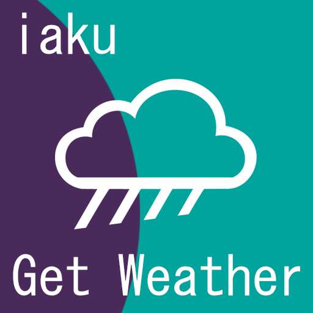
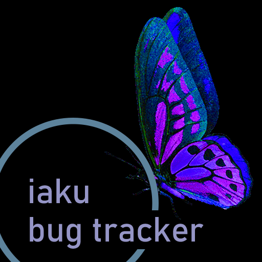
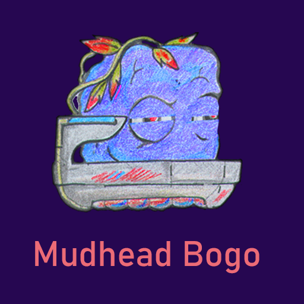
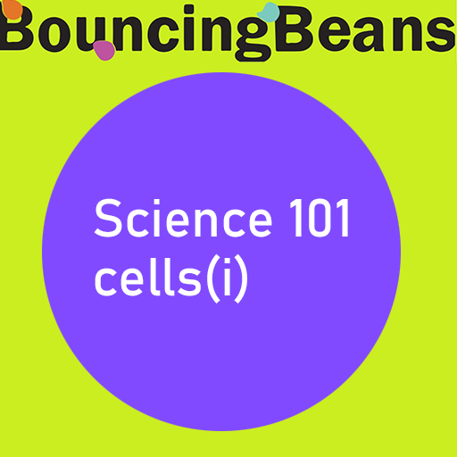

L.Blair | Development &amp; Design

<a href="https://lenardblair.github.io/get_weather" target="_blank">Iaku Get Weather</a>

Type: Software | gdscript, openweathermap.org, rest-api, http-client

Iaku Get Weather: A fun, minimalist, 5-Day Weather Forcast App. Designed for classroom and office display boards

 

<a href="https://github.com/lenardblair/iaku_bug_tracker" target="_blank">Iaku Bug Tracker</a>

Type: Software | vue.js, express, sequelize, rest-api, gdscript, http-client

A simple bug tracker with decoupled admin and front-end experiences

 

<a href="https://tools-and-projects.itch.io/gdscript-basics-app" target="_blank">GDScript Bascis App</a>

Type: Software | gdscript

A simple GDScript Basics learning app and cheat-sheet.

 

<a href="https://rustyraygun.github.io/mudhead_bogo.html" target="_blank">Mudhead Bogo</a>

Type: Game-Software | gdscript

Master unique player movement, while tracking gems, generators and key areas to master each level.

 

<a href="https://rustyraygun.github.io/sebo.html" target="_blank">Mudhead Bogo</a>

Type: Game-Software | gdscript

Drop, Toss and Steer Sebo pinball style to clear the level of blocks.

 

<a href="https://github.com/lenardblair/bouncingbeans_cells_1" target="_blank">Bouncing Beans: Cells(i)</a>

Type: Game-Educational Software | gdscript, python, flask, flextype-cms

Learn about the basics of Mitosis / The Cell Cycle with this interactive quiz.

 
<a href="https://lenardblair.github.io/development_portfolio/index.html" alt="older-projects" target="_blank">Older Projects [archive]</a>

